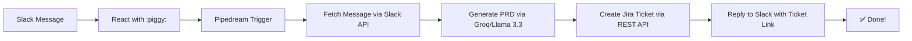
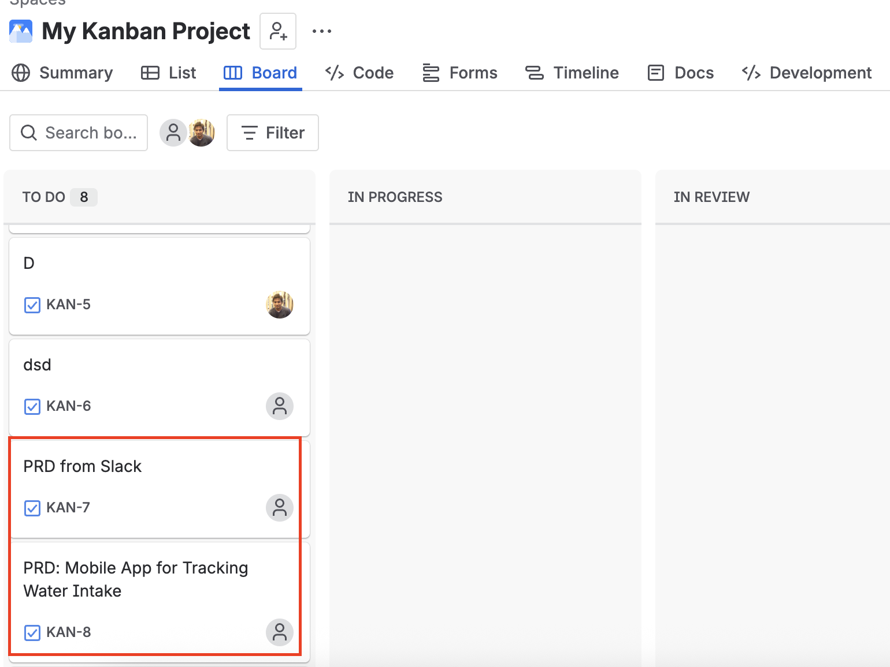
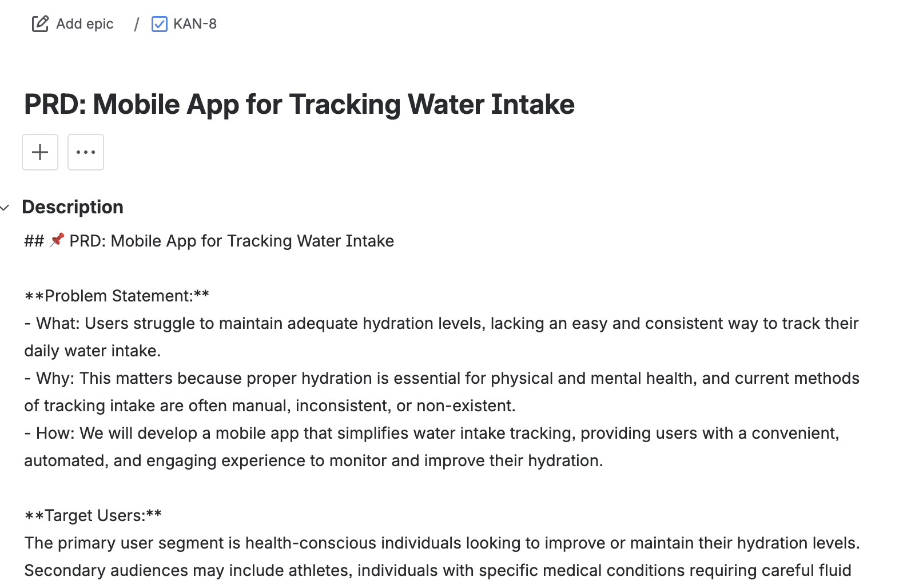

# 🤖 Slack → PRD → Jira Automator

> Turn any Slack message into a structured Product Requirements Document (PRD) and Jira ticket with a single emoji reaction.
## 🧩 Architecture

Screenshot one - 
Screenshot two - 

## ✨ Features

- 🎯 **One-click trigger**: React with `:piggy:` to any Slack message
- 🧠 **AI-powered PRD**: Uses Groq + Llama 3.3 to generate engineering-ready PRDs
- 🎫 **Auto Jira ticket**: Creates a ticket with the full PRD in the description
- 💬 **Slack confirmation**: Replies with ticket link and summary
- 🆓 **100% free tier**: Built with free tools (Pipedream, Groq, Jira Free, Slack Free)

## 🚀 Live Demo

[▶️ Watch the 60-second demo video](demo/demo-video.mp4)

**Try it yourself** (requires setup):
1. Install the workflow to your Pipedream account
2. Connect your Slack + Jira + Groq accounts
3. Post a message in Slack and react with 🐷

## ⚙️ Quick Setup (5 minutes)

### Prerequisites
- [Slack workspace](https://slack.com) (Free)
- [Jira Cloud site](https://www.atlassian.com/software/jira/free) (Free, up to 10 users)
- [Groq API key](https://console.groq.com) (Free tier)
- [Pipedream account](https://pipedream.com) (Free, 1,000 runs/mo)

### Steps
1. **Fork this repo** and star ⭐ if you find it useful!
2. **Import the workflow**:
   - Go to [Pipedream](https://pipedream.com) → **New Workflow** → **Import from JSON**
   - Upload `workflow.json` from this repo
3. **Configure credentials**:
   - Slack: Connect via OAuth (Pipedream guides you)
   - Groq: Paste your API key from [console.groq.com](https://console.groq.com)
   - Jira: Enter your domain, email, and API token ([get token here](https://id.atlassian.com/manage-profile/security/api-tokens))
4. **Deploy** and test!

👉 [Full setup guide with screenshots](docs/setup-guide.md)

### 🔧 Customization

- **Change the trigger emoji**: 
  Edit the Pipedream trigger step → **Filter by reaction** → Change `piggy` to your preferred emoji (e.g., `clipboard`, `rocket`).

- **Modify the PRD format**: 
  Edit `src/prd-prompt.txt` and re-import the prompt into the Groq step in Pipedream.

- **Add wireframe generation**: 
  See [docs/wireframe-addon.md](docs/wireframe-addon.md) for optional AI image generation using Hugging Face.

### 🛠️ Troubleshooting

| Issue | Solution |
| :--- | :--- |
| `invalid_auth` | Reinstall Slack app, copy fresh token |
| `missing_scope` | Add `channels:history`, `groups:history` scopes + reinstall |
| `not_in_channel` | Run `/invite @YourBotName` in the Slack channel |
| Jira `customfield_XXX` errors | Remove optional fields in Pipedream Jira step |
| Variables show `undefined` | Clear test cache + re-insert variables via `{}` picker |

👉 [Detailed troubleshooting guide](docs/troubleshooting.md)

### 🤝 Contributing

Found a bug or have an enhancement idea? Open an issue or PR! 🙌

###  License

MIT License — feel free to use, modify, and share! See [LICENSE](LICENSE).

---

Built with ❤️ by [Kiron](https://github.com/ashiqkiron). Inspired by the need to turn chaotic Slack ideas into actionable engineering work.

